<div align="center">


### Detect unauthorized PLC logic changes before they become physical incidents.

[](../../actions/workflows/ci.yml)


[Quick start](#quick-start) · [Demo](#run-an-attack) · [How it works](#how-it-works) · [Docs](docs/)

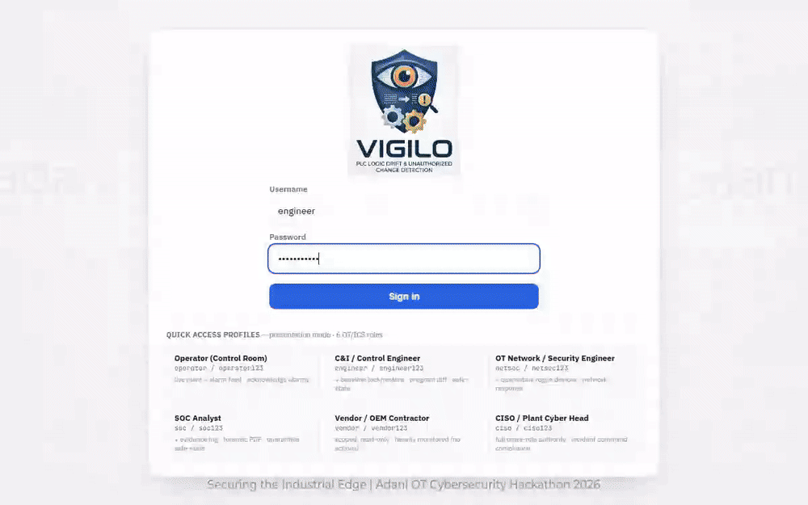

</div>

LogicWard watches a PLC's control program and live process state, and raises
severity-ranked, MITRE-mapped alerts the instant either drifts from a
cryptographically signed, approved baseline. It runs as a single-machine
simulation lab — a PLC simulator, a detection engine, and a SOC dashboard
(branded **Vigilo**) — so you can watch an attack land and get detected end to end.

The PLC "program" is a real Rockwell **L5X** file: it is parsed, canonicalized, and
diffed — **never executed.**

## Why this matters

- **Modbus has no authentication** — anyone on the OT network can write a setpoint or force a coil.
- **PLCs rarely log program changes** — a modified safety interlock can sit undetected for months.
- **One flipped comparator can disable a boiler trip.** LogicWard catches that flip in ~1 second.

## What it detects

| Mutation | Example | Severity | MITRE ATT&CK for ICS |
|---|---|---|---|
| Setpoint drift | Drum-level trip 220 → 40 mm | high | T0836 Modify Parameter |
| Logic inversion | `LES` → `GRT` on a trip comparator | high | T0843 + T0889 |
| Condition stripping | Remove the `Plant_Running` interlock | critical | T0843 + T0889 |
| Coil hijack | Repoint `Feedwater_Trip` → `Cooling_Pump_Stop` | high | T0843 + T0889 |
| Rung injection | Insert a hidden backdoor rung | high | T0843 Program Download |
| Branch restructure | Flame trip `A·B` → `A+B` (AND → OR) | high | T0843 + T0889 |
| Non-ladder routine change | Add/modify a Structured Text routine | high | T0889 Modify Program |
| Task re-scheduling | Move a routine out of the safety scan | high | T0889 Modify Program |
| Raw register / coil write | Force a holding register over Modbus | medium | T0855 Unauthorized Command |
| Transient write | Write-and-revert inside one poll interval | medium | T0855 (evasion) |
| Rogue device | Unknown MAC on the OT segment | medium | T0848 / unauthorized device |
| DoS | Modbus flood → CPU/RAM spike | medium | T0814 Denial of Service |
| Baseline tamper | Edit the signed baseline off-platform | critical | T0872 Indicator Removal |

## Screenshots

<table>
<tr>
<td width="50%">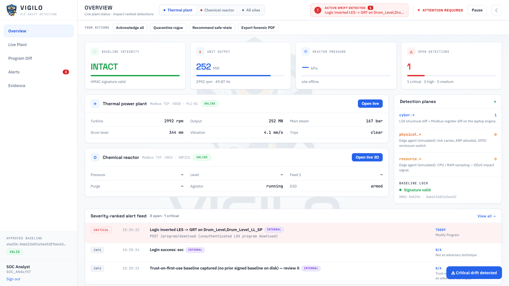<br><sub>Overview — risk, baseline integrity, live plant</sub></td>
<td width="50%">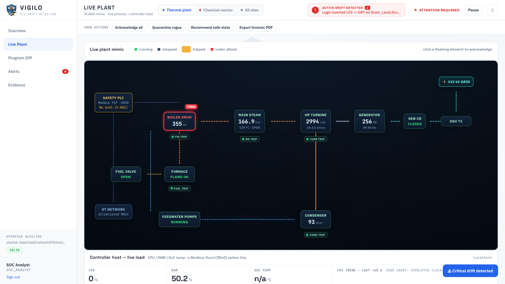<br><sub>SCADA mimic — affected component redlined with its MITRE chip</sub></td>
</tr>
<tr>
<td width="50%">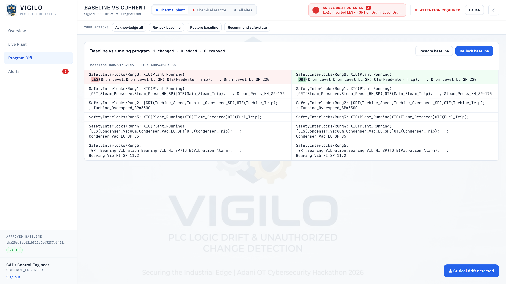<br><sub>GitHub-style L5X diff — the exact operator that flipped</sub></td>
<td width="50%">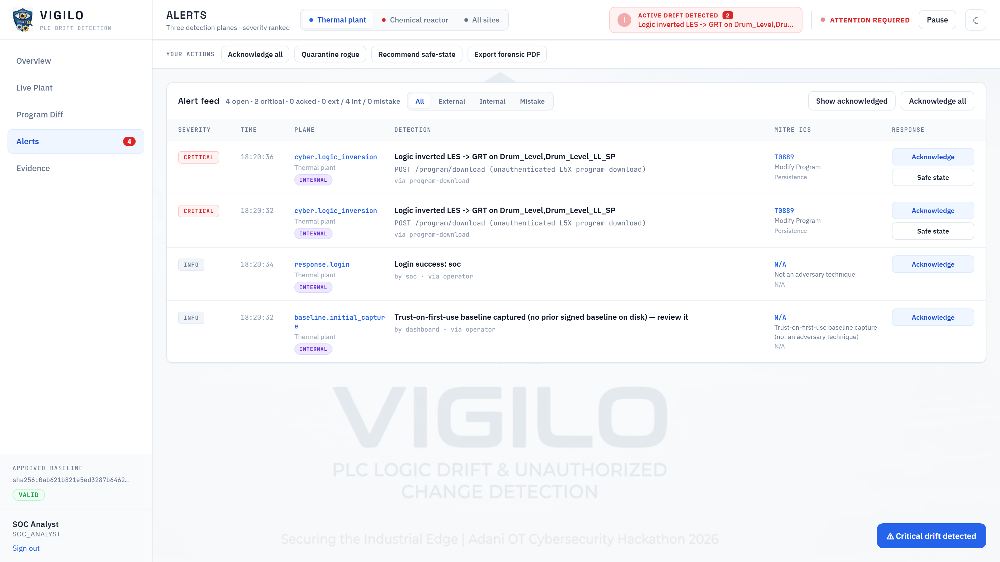<br><sub>Alert feed — severity, origin (external/internal/mistake), MITRE</sub></td>
</tr>
<tr>
<td width="50%">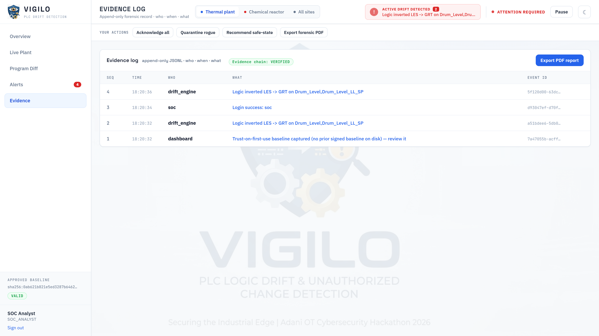<br><sub>Evidence log — hash-chained, "chain: VERIFIED"</sub></td>
<td width="50%">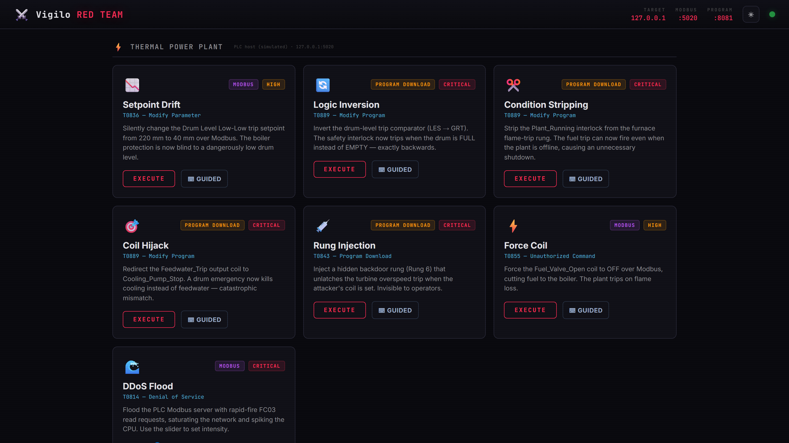<br><sub>Red-team console — the attack catalogue</sub></td>
</tr>
</table>

## How it works

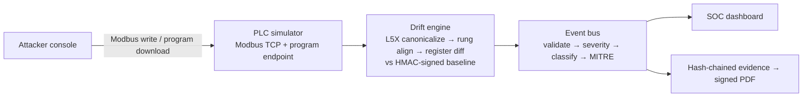

1. The **drift engine** pulls the live L5X program and Modbus registers every second.
2. It **canonicalizes** the program (strips volatile timestamps/CRCs/comments, parses ladder into an AND/OR logic tree) and diffs it rung-by-rung against the signed baseline — so a harmless re-export hashes identically, but a real logic change does not.
3. Each change becomes one **Event**, enriched with severity, attacker identity, an attack-origin category, and a MITRE ATT&CK for ICS technique.
4. Events fan out to the **dashboard**, an **append-only hash-chained evidence log**, and a **signed PDF** report.

<details><summary><b>Under the hood</b> — the core logic, in six excerpts</summary>

| | |
|---|---|
|  | Logic-only canonical form + structural hash |
| 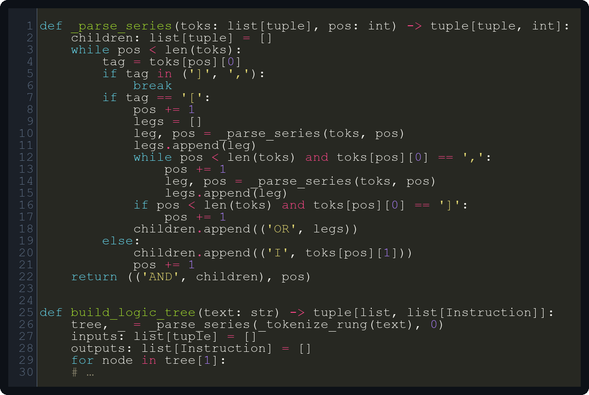 | AND/OR branch parser (makes `A·B` vs `A+B` visible) |
|  | Inversion-vs-stripping pairing in the rung diff |
| 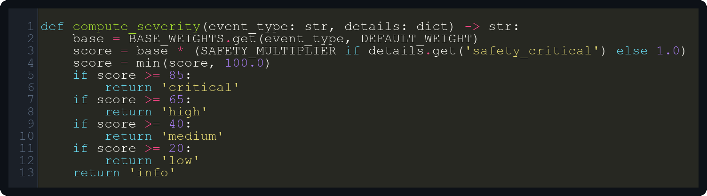 | Severity weights + scoring |
| 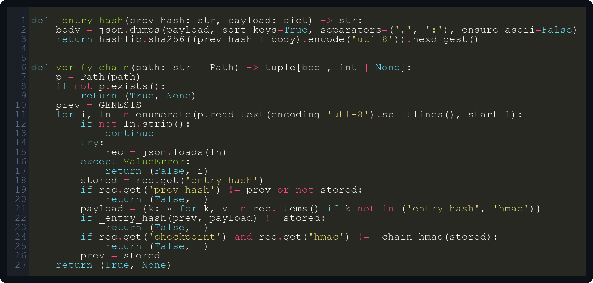 | Tamper-evident evidence chain |
| 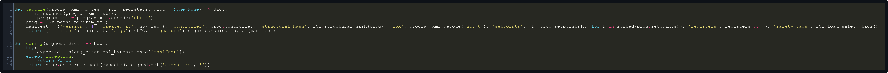 | HMAC capture / verify of the baseline |

</details>

## Quick start

```bash
pip install -e .
python -m logicward demo          # dashboard + red-team console + browser
# open http://127.0.0.1:8080/  (SOC)  ·  http://127.0.0.1:9090/  (red team)
```

…or with Docker:

```bash
docker compose up                 # SOC on :8080, red-team console on :9090
```

| Login | Role | Sees / can do |
|---|---|---|
| `soc / soc123` | SOC Analyst | everything read-only + evidence export |
| `engineer / engineer123` | Control Engineer | program diff, re-lock baseline, safe-state |
| `operator / operator123` | Operator | live plant, acknowledge alerts |
| `netsec / netsec123` | Network Engineer | quarantine rogue devices |
| `vendor / vendor123` | Vendor (monitored) | read-only, scoped |
| `ciso / ciso123` | CISO | full cross-role authority |

## Run an attack

The self-contained scripted demo drives the full attack catalogue with narration:

```bash
python -m logicward.attacker.demo_sequence --fast     # ~15s
```

Or fire one from the CLI / red-team console against a running PLC host:

```bash
python -m logicward attack logic-inversion            # LES → GRT on the drum-level trip
python -m logicward attack branch-restructure         # flame trip AND → OR
python -m logicward attack setpoint-drift             # Modbus FC06 setpoint write
```

Watch the dashboard: the affected component redlines on the mimic, the diff view
highlights the exact rung, and a MITRE-mapped alert lands in the feed within ~1s.

## Tech stack

Python · Flask · lxml · raw-socket Modbus TCP · watchdog · reportlab · cryptography (Ed25519) · Playwright

## Project structure

```
logicward/
├── engine/      # event bus, L5X parse/canonicalize, drift detection, baseline, MITRE
├── plant/       # raw-socket Modbus PLC simulator + tag↔register map + program store
├── dashboard/   # Flask SOC app, RBAC, SCADA mimic, diff, evidence, signed PDF
├── attacker/    # attack toolkit, scripted demo, red-team console
├── agent/       # edge sensors (network/host/physical) — simulation fallbacks
├── sites/       # second monitored site (GRFICS chemical reactor)
└── tests/       # 11 integration smoke suites (213 checks)
```

## Security notes & limitations

- **Lab / demo tool, not for production plants.** The simulated PLC exposes
  unauthenticated Modbus and an unauthenticated program-download endpoint *on purpose* —
  that is the threat being demonstrated.
- **Demo mode** ships well-known logins and an ephemeral session key. Set
  `LOGICWARD_DEMO_MODE=0` (with `LOGICWARD_SECRET`/`TOKEN`/`HMAC_KEY`) for a hardened run.
- Detection is **polling-based** (~1s) and **trusts the program the PLC reports**. In a
  real deployment you would corroborate with passive network monitoring (a Modbus/Zeek
  sensor) so a compromised PLC can't lie about its own program.
- The HMAC baseline is **integrity, not access control**; it detects tamper-without-the-key.

## Roadmap

- [ ] Passive Zeek/Suricata Modbus sensor (corroborate the pull-based program read)
- [ ] SIEM forwarder (Wazuh / Splunk) off the evidence log
- [ ] OPC UA / Siemens S7 support
- [ ] Multi-PLC inventory and fleet view

<details><summary>Optional: edge-hardware deployment</summary>

LogicWard also runs split across two hosts and was tested on a Raspberry Pi 4 as the
PLC host (edge agent + Modbus server), with the engine + dashboard on a laptop. See
[docs/DEPLOYMENT.md](docs/DEPLOYMENT.md).

</details>

## Credits & license

Built for the Adani OT Cybersecurity Hackathon 2026. Licensed under the [MIT License](LICENSE).
